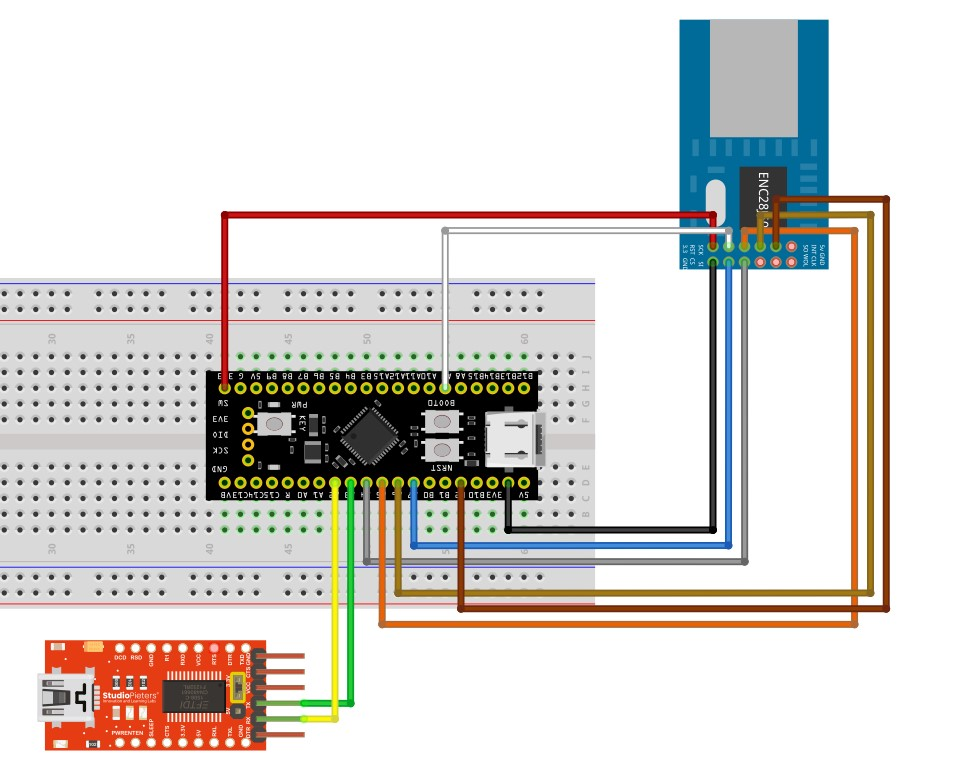
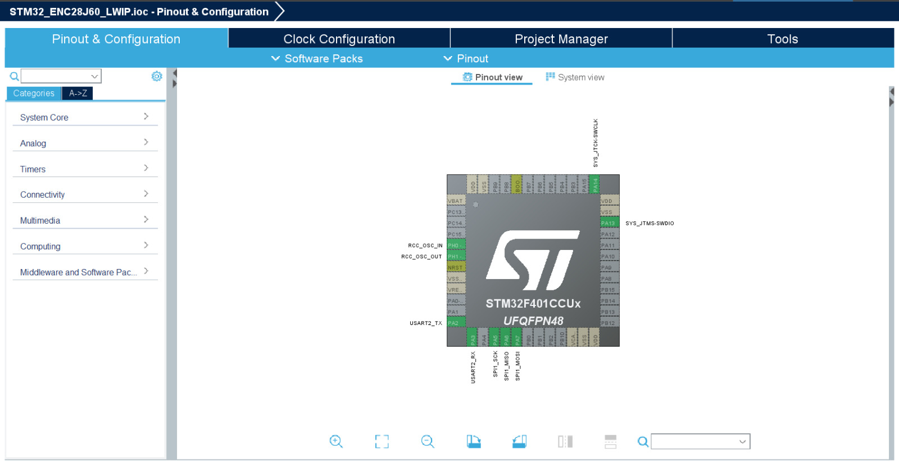
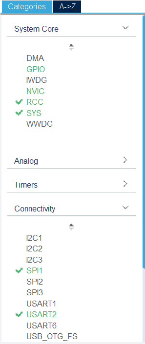
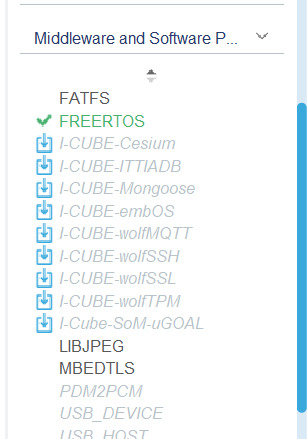
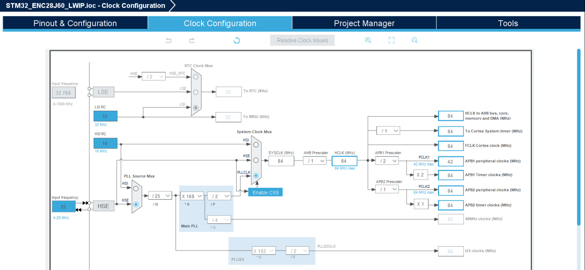
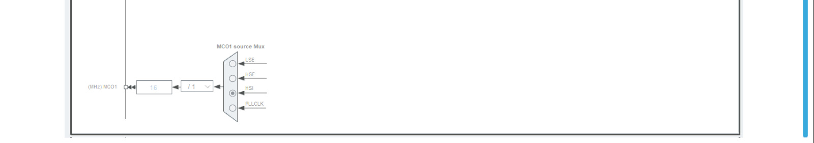
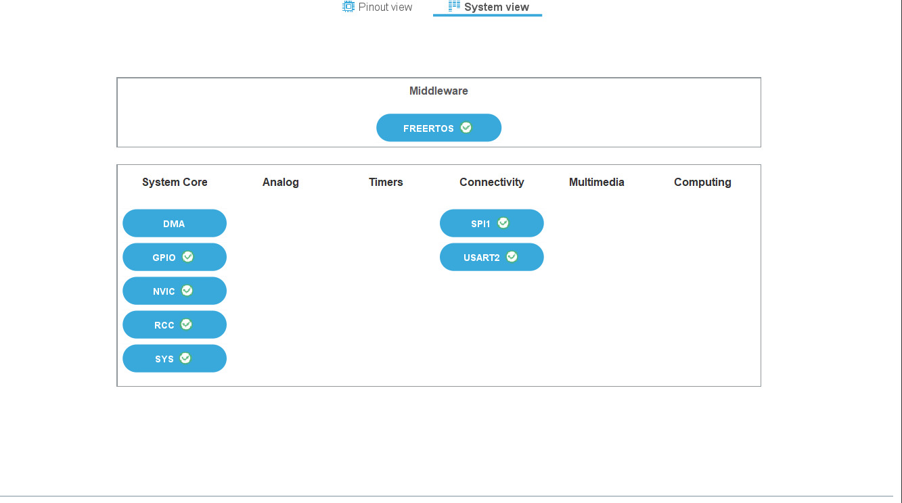

# stm32f401xx-enc28j60-lwip
Pemrograman koneksi Ethernet menggunakan STM32F401
🇮🇩 Bahasa Indonesia | [🇬🇧 English](README.en.md)

---

## 📦 Perangkat yang Dibutuhkan
- **STM32F401 Development Board**
- **Modul Ethernet ENC28J60**
- **Kabel Ethernet (RJ45)**
- **Breadboard dan kabel jumper**
- **Catu daya sesuai kebutuhan**

---

## 🔌 Skema Koneksi Perangkat
Hubungkan pin STM32F401 ke ENC28J60 sesuai tabel berikut:

| **Pin STM32F401** | **Pin ENC28J60** |
|--------------------|------------------|
| GND                | GND             |
| 3.3V               | VCC             |
| PA5 (SPI_SCK)      | SCK             |
| PA6 (SPI_MISO)     | SO              |
| PA7 (SPI_MOSI)     | SI              |
| PA4 (SPI_CS)       | CS              |
| PA8                | RESET           |
| PB2                | INT             |

**Catatan:**
- Pastikan ENC28J60 memakai catu daya 3.3V.

---

## 🛠️ Instalasi Software

### 1. **Instalasi Toolchain**
- Download dan install **STM32CubeIDE** dari [STMicroelectronics](https://www.st.com).
- Pastikan kamu memiliki library STM32 HAL yang sesuai (FreeRTOS).
  
### 2. **Menambahkan Library ENC28J60 dan LwIP**
- Library **LwIP & ENC28J60** tersedia di repository ini. 

---

## ⚙️ Konfigurasi Project STM32

### **Pengaturan SPI dan USART**
1. Buka **STM32CubeMX** dan buat project baru.
2. Aktifkan **SPI1**:
   - Mode: *Full Duplex Master*
   - Prescaler: Sesuaikan baud rate dengan kebutuhanmu.
3. Atur pin SPI:
   - PA5: SPI1_SCK
   - PA6: SPI1_MISO
   - PA7: SPI1_MOSI
   - PA4: SPI1_CS
4. Aktifkan clock untuk GPIO dan SPI.
5. Aktifkan pin USART untuk debugging:
   - PA2 : USART2_TX
   - PA3 : USART2_RX

   
### 2. **Konfigurasi Clock**
- Atur system clock menggunakan **HSE/PLL** untuk performa tinggi.

---

### Implementasi Fungsi ENC28J60

Gunakan fungsi dari library ENC28J60 untuk:

- Inisialisasi modul
- Mengirim paket data lewat Ethernet (lihat file tutorial.md)

---

### 🧪 Pengujian

1. Hubungkan ENC28J60 ke router atau switch menggunakan kabel Ethernet.
2. Jalankan kode di STM32.
3. Gunakan aplikasi seperti **Wireshark** untuk memantau paket data yang dikirim.

---

## 🎉 Kesimpulan

Dengan mengikuti tutorial ini, kamu sudah bisa menghubungkan STM32F401 dengan modul ENC28J60 untuk komunikasi Ethernet. Tutorial ini memberikan langkah-langkah dasar, namun kamu bisa mengembangkannya lebih lanjut sesuai kebutuhan project. Jika ada pertanyaan, saran, atau masalah, jangan ragu membuka *issue* di repository ini atau menghubungi kami.

Semoga sukses! 🚀
